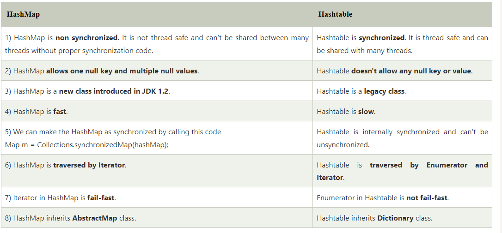

# java-data-structure

## Collections in Java

The Collection in Java is a framework that provides an architecture to store and manipulate the group of objects.

Java Collections can achieve all the operations that you perform on a data such as searching, sorting, insertion, manipulation, and deletion.

Java Collection means a single unit of objects. Java Collection framework provides many 
interfaces (Set, List, Queue, Deque) and 
classes (ArrayList, Vector, LinkedList, PriorityQueue, HashSet, LinkedHashSet, TreeSet).

Let us see the hierarchy of Collection framework. The java.util package contains all the classes and interfaces for the Collection framework.


### Collection inteface


Collection is a group of objects, which are known as elements. It is the root interface in the collection hierarchy. This interface is basically used to pass around the collections and manipulate them where the maximum generality is desired.


* add()	This method returns a Boolean value true if it inserts the specified element in this collection.
* addAll()	This method returns a Boolean value true if it adds all the elements of specified collection in the invoking collection.
* clear()	It removes all the elements automatically from this collection.
* contains()	It returns a Boolean value true if this queue contains the specified element.
* containsAll()	It returns a Boolean value true if this collection contains all the elements in the specified collection.
* equals()	This method returns a boolean value true if the specified object is equal with this collection.
* hashCode()	It returns a hash code value for this collection.
* isEmpty()	This method returns true if this collection contains no elements or is empty.
* iterator()	It returns an iterator over the elements in proper sequence.
* remove()	It removes the specified element from this queue, if it is present in the collection.
* removeAll()	It removes all the elements of this collection which are also present in the specified collection.
* removeIf()	It removes all the elements of this collection that satisfy the given predicate filter.
* retainAll()	This method retains only those elements in this collection that are present in the specified collection.
* size()	It returns the total number of the elements in this collection.
* spliterator()	It returns a spliterator over the elements in this collection.
* toArray()	It returns an array containing all the elements of this collection which are in proper sequence.


all class that implements collection interface can use the collection interface methods


```java
  
Set<Integer> set = new HashSet<>();  
// inserts the specified element in this collection  
set.add(2);  
set.add(5);  
System.out.println("Initial collection :"+set);  
//it adds all the elements of specified collection in the invoking collection.  
Collections.addAll(set, 11, 12, 13, 14, 15);  
System.out.println("Final Collection : "+set);  
//returns the total size of the collection  
int size =set.size();  
System.out.println("Size of Collection : "+size);  
//It returns a Boolean value true if this queue contains the specified element.  
Boolean val=set.contains(5);  
if (val){  
   System.out.println("5 is present in the collection");  
}  
else{  
   System.out.println("5 is not present in the collection");  
}  
//It removes all the elements automatically from this collection.  
set.clear();  
System.out.println("Elements in collection : "+set);  
```


### Iterator interface

Iterator interface provides the facility of iterating the elements in a forward direction only.

* public boolean hasNext()	It returns true if the iterator has more elements otherwise it returns false.
* public Object next()	It returns the element and moves the cursor pointer to the next element.
* public void remove()	It removes the last elements returned by the iterator. It is less used.

### Iterable Interface

The Iterable interface is the root interface for all the collection classes. The Collection interface extends the Iterable interface and therefore all the subclasses of Collection interface also implement the Iterable interface.

### Collection Interface

The Collection interface is the interface which is implemented by all the classes in the collection framework. It declares the methods that every collection will have. In other words, we can say that the Collection interface builds the foundation on which the collection framework depends.

### List Interface

List interface is the child interface of Collection interface. It inhibits a list type data structure in which we can store the ordered collection of objects. It can have duplicate values.

List interface is implemented by the classes ArrayList, LinkedList, Vector, and Stack.

```java
List <data-type> list1= new ArrayList();  
List <data-type> list2 = new LinkedList();  
List <data-type> list3 = new Vector();  
List <data-type> list4 = new Stack();  
```

List in Java provides the facility to maintain the ordered collection. It contains the index-based methods to insert, update, delete and search the elements. It can have the duplicate elements also. We can also store the null elements in the list.


* void add(int index, E element)	It is used to insert the specified element at the specified position in a list.
* boolean add(E e)	It is used to append the specified element at the end of a list.
* boolean addAll(Collection<? extends E> c)	It is used to append all of the elements in the specified collection to the end of a list.
* boolean addAll(int index, Collection<? extends E> c)	It is used to append all the elements in the specified collection, starting at the specified position of the list.
* void clear()	It is used to remove all of the elements from this list.
* boolean equals(Object o)	It is used to compare the specified object with the elements of a list.
* int hashcode()	It is used to return the hash code value for a list.
* E get(int index)	It is used to fetch the element from the particular position of the list.
* boolean isEmpty()	It returns true if the list is empty, otherwise false.
* int lastIndexOf(Object o)	It is used to return the index in this list of the last occurrence of the specified element, or -1 if the list does not contain this element.
* Object[] toArray()	It is used to return an array containing all of the elements in this list in the correct order.
* <T> T[] toArray(T[] a)	It is used to return an array containing all of the elements in this list in the correct order.
* boolean contains(Object o)	It returns true if the list contains the specified element
* boolean containsAll(Collection<?> c)	It returns true if the list contains all the specified element
* int indexOf(Object o)	It is used to return the index in this list of the first occurrence of the specified element, or -1 if the List does not contain this element.
* E remove(int index)	It is used to remove the element present at the specified position in the list.	
* boolean remove(Object o)	It is used to remove the first occurrence of the specified element.	
* boolean removeAll(Collection<?> c)	It is used to remove all the elements from the list.	
* void replaceAll(UnaryOperator<E> operator)	It is used to replace all the elements from the list with the specified element.	
* void retainAll(Collection<?> c)	It is used to retain all the elements in the list that are present in the specified collection.	
* E set(int index, E element)	It is used to replace the specified element in the list, present at the specified position.	
* void sort(Comparator<? super E> c)	It is used to sort the elements of the list on the basis of specified comparator.	
* Spliterator<E> spliterator()	It is used to create spliterator over the elements in a list.	
* List<E> subList(int fromIndex, int toIndex)	It is used to fetch all the elements lies within the given range.	
* int size()	It is used to return the number of elements present in the list.


How to convert List to Array

```java
   List<String> fruitList = new ArrayList<>();    
     fruitList.add("Mango");    
     fruitList.add("Banana");    
     fruitList.add("Apple");    
     fruitList.add("Strawberry");    
     //Converting ArrayList to Array  
     String[] array = fruitList.toArray(new String[fruitList.size()]);    
     System.out.println("Printing Array: "+Arrays.toString(array));  
     System.out.println("Printing List: "+fruitList);  

```


#### ListIterator Interface

* void add(E e)	This method inserts the specified element into the list.
* boolean hasNext()	This method returns true if the list iterator has more elements while traversing the list in the forward direction.
* E next()	This method returns the next element in the list and advances the cursor position.
* int nextIndex()	This method returns the index of the element that would be returned by a subsequent call to next()
* boolean hasPrevious()	This method returns true if this list iterator has more elements while traversing the list in the reverse direction.
* E previous()	This method returns the previous element in the list and moves the cursor position backward.
* E previousIndex()	This method returns the index of the element that would be returned by a subsequent call to previous().
* void remove()	This method removes the last element from the list that was returned by next() or previous() methods
* void set(E e)	This method replaces the last element returned by next() or previous() methods with the specified element.


```java
List<String> al=new ArrayList<String>(); 
        al.add("Amit");    
        al.add("Vijay");    
        al.add("Kumar");    
        al.add(1,"Sachin");    
        ListIterator<String> itr=al.listIterator();    
        System.out.println("Traversing elements in forward direction");    
        while(itr.hasNext()){    
              
        System.out.println("index:"+itr.nextIndex()+" value:"+itr.next());    
        }    
        System.out.println("Traversing elements in backward direction");    
        while(itr.hasPrevious()){    
          
        System.out.println("index:"+itr.previousIndex()+" value:"+itr.previous());    
        }  
```


#### ArrayList

The ArrayList class implements the List interface. It uses a dynamic array to store the duplicate element of different data types. The ArrayList class maintains the insertion order and is non-synchronized. The elements stored in the ArrayList class can be randomly accessed. Consider the following example.

ArrayListExample.java

Java ArrayList class uses a dynamic array for storing the elements. It is like an array, but there is no size limit. We can add or remove elements anytime. 

* Java ArrayList class can contain duplicate elements.
* Java ArrayList class maintains insertion order.
* Java ArrayList class is non synchronized.
* Java ArrayList allows random access because the array works on an index basis.
* In ArrayList, manipulation is a little bit slower than the LinkedList in Java because a lot of shifting needs to occur if any element is removed from the array list.
* We can not create an array list of the primitive types, such as int, float, char, etc. It is required to use the required wrapper class in such cases. For example:

```java
ArrayList<int> al = ArrayList<int>(); // does not work  
ArrayList<Integer> al = new ArrayList<Integer>(); // works fine  
```

* Java ArrayList gets initialized by the size. The size is dynamic in the array list, which varies according to the elements getting added or removed from the list.


* ArrayList()	It is used to build an empty array list.
* ArrayList(Collection<? extends E> c)	It is used to build an array list that is initialized with the elements of the collection c.
* ArrayList(int capacity)	It is used to build an array list that has the specified initial capacity.

* void add(int index, E element)	It is used to insert the specified element at the specified position in a list.
* boolean add(E e)	It is used to append the specified element at the end of a list.
* boolean addAll(Collection<? extends E> c)	It is used to append all of the elements in the specified collection to the end of this list, in the order that they are returned by the specified collection's iterator.
* boolean addAll(int index, Collection<? extends E> c)	It is used to append all the elements in the specified collection, starting at the specified position of the list.
* void clear()	It is used to remove all of the elements from this list.
* void ensureCapacity(int requiredCapacity)	It is used to enhance the capacity of an ArrayList instance.
* E get(int index)	It is used to fetch the element from the particular position of the list.
* boolean isEmpty()	It returns true if the list is empty, otherwise false.
* int lastIndexOf(Object o)	It is used to return the index in this list of the last occurrence of the specified element, or -1 if the list does not contain this element.
* Object[] toArray()	It is used to return an array containing all of the elements in this list in the correct order.
* <T> T[] toArray(T[] a)	It is used to return an array containing all of the elements in this list in the correct order.
* Object clone()	It is used to return a shallow copy of an ArrayList.
* boolean contains(Object o)	It returns true if the list contains the specified element.
* int indexOf(Object o)	It is used to return the index in this list of the first occurrence of the specified element, or -1 if the List does not contain this element.
* E remove(int index)	It is used to remove the element present at the specified position in the list.
* boolean remove(Object o)	It is used to remove the first occurrence of the specified element.
* boolean removeAll(Collection<?> c)	It is used to remove all the elements from the list.
* boolean removeIf(Predicate<? super E> filter)	It is used to remove all the elements from the list that satisfies the given predicate.
* protected void removeRange(int fromIndex, int toIndex)	It is used to remove all the elements lies within the given range.
* void replaceAll(UnaryOperator<E> operator)	It is used to replace all the elements from the list with the specified element.
* void retainAll(Collection<?> c)	It is used to retain all the elements in the list that are present in the specified collection.
* E set(int index, E element)	It is used to replace the specified element in the list, present at the specified position.
* void sort(Comparator<? super E> c)	It is used to sort the elements of the list on the basis of the specified comparator.
* Spliterator<E> spliterator()	It is used to create a spliterator over the elements in a list.
* List<E> subList(int fromIndex, int toIndex)	It is used to fetch all the elements that lies within the given range.
* int size()	It is used to return the number of elements present in the list.
* void trimToSize()	It is used to trim the capacity of this ArrayList instance to be the list's current size.


use set and get with array index position

use Collections.sort to sort the list

There are various ways to traverse the collection elements:

* By Iterator interface.
* By for-each loop.
* By ListIterator interface.
* By for loop.
* By forEach() method.
* By forEachRemaining() method.

```java
ArrayList<String> list = new ArrayList<String>();
list.add("Mango");//Adding object in arraylist    
list.add("Apple");    
list.add("Banana");    
list.add("Grapes");    

System.out.println("get first element " + list.get(0));

list.set(1,"Yellow Apple");

Collections.sort(list);

System.out.println(list);

Iterator itr = list.iterator();
while(itr.hasNext()) {
    System.out.print(" "+itr.next());
}

System.out.println();

for(String fruit: list) {
    System.out.print(" "+fruit);
}

System.out.println();

//Here, element iterates in reverse order  
ListIterator<String> list1=list.listIterator(list.size());  
while(list1.hasPrevious())  
{  
    System.out.print(" "+list1.previous());
}  

System.out.println();

System.out.println("Traversing list through for loop:");  
for(int i=0;i<list.size();i++)  
{  
    System.out.println(list.get(i));     
}  

System.out.println();

System.out.println("Traversing list through forEach() method:");  
//The forEach() method is a new feature, introduced in Java 8.  
list.forEach(a->{ //Here, we are using lambda expression  
    System.out.println(a);  
});  

System.out.println();

System.out.println("Traversing list through forEachRemaining() method:");  
    Iterator<String> itr2=list.iterator();  
    itr2.forEachRemaining(a-> //Here, we are using lambda expression  
    {  
        System.out.println(a);  
    });      
```

#### Java Non-generic Vs. Generic Collection

Java collection framework was non-generic before JDK 1.5. Since 1.5, it is generic.

Java new generic collection allows you to have only one type of object in a collection. Now it is type-safe, so typecasting is not required at runtime.

Let's see the old non-generic example of creating a Java collection.

```java
ArrayList list=new ArrayList();//creating old non-generic arraylist  
```

Let's see the new generic example of creating java collection.

```java
ArrayList<String> list=new ArrayList<String>();//creating new generic arraylist  
```

In a generic collection, we specify the type in angular braces. Now ArrayList is forced to have the only specified type of object in it. If you try to add another type of object, it gives a compile-time error.

User-defined class objects in Java ArrayList

```java
class Student {
    int rollno;
    String name;
    int age;
    
    Student(int rollno, String name, int age) {
        this.rollno = rollno;
        this.name = name;
        this.age = age;
    }
}
```

```java
Student s1 = new Student(323,"min ku nam", 22);
Student s2 =new Student(102,"Ravi",21);  
Student s3 =new Student(103,"Hanumat",25);  

ArrayList<Student> students = new ArrayList<Student>();
students.add(s1);
students.add(s2);
students.add(s3);

for(Student student: students) {
    System.out.println("rollno : " + student.rollno + " name : " + student.name + " age : " + student.age);
}
```

```java
ArrayList<String> al=new ArrayList<String>();  
       
//Adding elements to the end of the list  
al.add("Ravi");  
al.add("Vijay");  
al.add("Ajay");  
al.remove("Vijay");  
    al.remove(0);  
    
System.out.println("Initial list of elements: "+al);  

ArrayList<String> al2=new ArrayList<String>();  
al2.add("Sonoo");  
al2.add("Hanumat");  
al.addAll(al2);  
System.out.println("After invoking addAll(Collection<? extends E> c) method: "+al);     

al.addAll(1, al2);  
System.out.println("After invoking addAll(int index, Collection<? extends E> c) method: "+al);  

al.removeAll(al2);
System.out.println("remove all : "+al);  

al.removeIf(str -> str.contains("Ajay"));
System.out.println("remove if : "+al); 

al.add("Ravi");  
al.add("Vijay"); 

System.out.println("after add: "+al);

al.clear();

System.out.println("clear: "+al);
```

```java
// capacity 10
ArrayList<Integer> al = new ArrayList<Integer>(10);  

System.out.println("Is ArrayList Empty: "+al.isEmpty());  

al.add("Ravi");  
al.add("Vijay");  
al.add("Ajay"); 

System.out.println("The size of the array is: " + al.size());  

ArrayList<String> al2=new ArrayList<String>();  
al2.add("Ravi");  
al2.add("Hanumat");  

al.retainAll(al2);
System.out.println(al);
```

Capacity represents the total number of elements the array list can contain. Therefore, the capacity of an array list is always greater than or equal to the size of the array list. When we add an element to the array list, it checks whether the size of the array list has become equal to the capacity or not. If yes, then the capacity of the array list increases. So, in the above example, the capacity will be 10 till 10 elements are added to the list. When we add the 11th element, the capacity increases. Note that in both examples, the capacity of the array list is 10. In the first case, the capacity is 10 because the default capacity of the array list is 10. In the second case, we have explicitly mentioned that the capacity of the array list is 10.

#### LinkedList

LinkedList implements the Collection interface. It uses a doubly linked list internally to store the elements. It can store the duplicate elements. It maintains the insertion order and is not synchronized. In LinkedList, the manipulation is fast because no shifting is required.

LinkedListExample.java

Java LinkedList class uses a doubly linked list to store the elements. It provides a linked-list data structure. It inherits the AbstractList class and implements List and Deque interfaces.

* Java LinkedList class can contain duplicate elements.
* Java LinkedList class maintains insertion order.
* Java LinkedList class is non synchronized.
* In Java LinkedList class, manipulation is fast because no shifting needs to occur.
* Java LinkedList class can be used as a list, stack or queue.


* LinkedList()	It is used to construct an empty list.
* LinkedList(Collection<? extends E> c)	It is used to construct a list containing the elements of the specified collection, in the order, they are returned by the collection's iterator.

* boolean add(E e)	It is used to append the specified element to the end of a list.
* void add(int index, E element)	It is used to insert the specified element at the specified position index in a list.
* boolean addAll(Collection<? extends E> c)	It is used to append all of the elements in the specified collection to the end of this list, in the order that they are returned by the specified collection's iterator.
* boolean addAll(int index, Collection<? extends E> c)	It is used to append all the elements in the specified collection, starting at the specified position of the list.
* void addFirst(E e)	It is used to insert the given element at the beginning of a list.
* void addLast(E e)	It is used to append the given element to the end of a list.
* void clear()	It is used to remove all the elements from a list.
* Object clone()	It is used to return a shallow copy of an ArrayList.
* boolean contains(Object o)	It is used to return true if a list contains a specified element.
* Iterator<E> descendingIterator()	It is used to return an iterator over the elements in a deque in reverse sequential order.
* E element()	It is used to retrieve the first element of a list.
* E get(int index)	It is used to return the element at the specified position in a list.
* E getFirst()	It is used to return the first element in a list.
* E getLast()	It is used to return the last element in a list.
* int indexOf(Object o)	It is used to return the index in a list of the first occurrence of the specified element, or -1 if the list does not contain any element.
* int lastIndexOf(Object o)	It is used to return the index in a list of the last occurrence of the specified element, or -1 if the list does not contain any element.
* ListIterator<E> listIterator(int index)	It is used to return a list-iterator of the elements in proper sequence, starting at the specified position in the list.
* boolean offer(E e)	It adds the specified element as the last element of a list.
* boolean offerFirst(E e)	It inserts the specified element at the front of a list.
* boolean offerLast(E e)	It inserts the specified element at the end of a list.
* E peek()	It retrieves the first element of a list
* E peekFirst()	It retrieves the first element of a list or returns null if a list is empty.
* E peekLast()	It retrieves the last element of a list or returns null if a list is empty.
* E poll()	It retrieves and removes the first element of a list.
* E pollFirst()	It retrieves and removes the first element of a list, or returns null if a list is empty.
* E pollLast()	It retrieves and removes the last element of a list, or returns null if a list is empty.
* E pop()	It pops an element from the stack represented by a list.
* void push(E e)	It pushes an element onto the stack represented by a list.
* E remove()	It is used to retrieve and removes the first element of a list.
* E remove(int index)	It is used to remove the element at the specified position in a list.
* boolean remove(Object o)	It is used to remove the first occurrence of the specified element in a list.
* E removeFirst()	It removes and returns the first element from a list.
* boolean removeFirstOccurrence(Object o)	It is used to remove the first occurrence of the specified element in a list (when traversing the list from head to tail).
* E removeLast()	It removes and returns the last element from a list.
* boolean removeLastOccurrence(Object o)	It removes the last occurrence of the specified element in a list (when traversing the list from head to tail).
* E set(int index, E element)	It replaces the element at the specified position in a list with the specified element.
* Object[] toArray()	It is used to return an array containing all the elements in a list in proper sequence (from first to the last element).
* <T> T[] toArray(T[] a)	It returns an array containing all the elements in the proper sequence (from first to the last element); the runtime type of the returned array is that of the specified array.
* int size()	It is used to return the number of elements in a list.

```java
 LinkedList<String> al=new LinkedList<String>();  
        
al.add("Ravi");  
al.add("Vijay");  
al.add("Ravi");  
al.add("Ajay");  
al.add(1, "Gaurav");  

Collections.sort(al);

System.out.println("Is LinkedList Empty: "+al.isEmpty());  

LinkedList<String> al2=new LinkedList<String>();  
al2.add("Ravi");  
    
System.out.println("After invoking addFirst(E e) method: "+al);  

al.addFirst("Lokesh");  
System.out.println("After invoking addFirst(E e) method: "+al);  
//Adding an element at the last position  
al.addLast("Harsh");  
System.out.println("After invoking addLast(E e) method: "+al);  

al.removeAll(al2);
System.out.println("After removeAll method: "+al);  

al.removeFirst();  
System.out.println("After removeAll method: "+al);  

al.removeLast(); 
System.out.println("After removeAll method: "+al);  

al.add("Ravi");  
al.add("Vijay");  
al.add("Ravi");  
al.add("Ajay");  

System.out.println("After adding: "+al);  

al.removeFirstOccurrence("Vijay");  
System.out.println("After removeFirstOccurrence: "+al);  

al.removeLastOccurrence("Ravi");  
System.out.println("After removeLastOccurrence: "+al);  

```


* When the rate of addition or removal rate is more than the read scenarios, then go for the LinkedList. On the other hand, when the frequency of the read scenarios is more than the addition or removal rate, then ArrayList takes precedence over LinkedList.
* Since the elements of an ArrayList are stored more compact as compared to a LinkedList; therefore, the ArrayList is more cache-friendly as compared to the LinkedList. Thus, chances for the cache miss are less in an ArrayList as compared to a LinkedList. Generally, it is considered that a LinkedList is poor in cache-locality.
* Memory overhead in the LinkedList is more as compared to the ArrayList. It is because, in a LinkedList, we have two extra links (next and previous) as it is required to store the address of the previous and the next nodes, and these links consume extra space. Such links are not present in an ArrayList.


#### Vector

Vector uses a dynamic array to store the data elements. It is similar to ArrayList. However, It is synchronized and contains many methods that are not the part of Collection framework.

```java
import java.util.*;  
public class TestJavaCollection3{  
    public static void main(String args[]){  
        Vector<String> v=new Vector<String>();  

        v.add("Ayush");  
        v.add("Amit");  
        v.add("Ashish");  
        v.add("Garima");  
        
        Iterator<String> itr=v.iterator();  
        while(itr.hasNext()){  
            System.out.println(itr.next());  
        }  
    }  
}  
```

Vector is like the dynamic array which can grow or shrink its size. Unlike array, we can store n-number of elements in it as there is no size limit. It is a part of Java Collection framework since Java 1.2. It is found in the java.util package and implements the List interface, so we can use all the methods of List interface here.

It is recommended to use the Vector class in the thread-safe implementation only. f you don't need to use the thread-safe implementation, you should use the ArrayList, the ArrayList will perform better in such case.


* vector()	It constructs an empty vector with the default size as 10.
* 	vector(int initialCapacity)	It constructs an empty vector with the specified initial capacity and with its capacity increment equal to zero.
* 	vector(int initialCapacity, int capacityIncrement)	It constructs an empty vector with the specified initial capacity and capacity increment.
* 	Vector( Collection<? extends E> c)	It constructs a vector that contains the elements of a collection c.


*	add()	It is used to append the specified element in the given vector.
* 2)	addAll()	It is used to append all of the elements in the specified collection to the end of this Vector.
* 3)	addElement()	It is used to append the specified component to the end of this vector. It increases the vector size by one.
* 4)	capacity()	It is used to get the current capacity of this vector.
* 5)	clear()	It is used to delete all of the elements from this vector.
* 6)	clone()	It returns a clone of this vector.
* 7)	contains()	It returns true if the vector contains the specified element.
* 8)	containsAll()	It returns true if the vector contains all of the elements in the specified collection.
* 9)	copyInto()	It is used to copy the components of the vector into the specified array.
* 10)	elementAt()	It is used to get the component at the specified index.
* 11)	elements()	It returns an enumeration of the components of a vector.
* 12)	ensureCapacity()	It is used to increase the capacity of the vector which is in use, if necessary. It ensures that the vector can hold at least the number of components specified by the minimum capacity argument.
* 13)	equals()	It is used to compare the specified object with the vector for equality.
* 14)	firstElement()	It is used to get the first component of the vector.
* 15)	forEach()	It is used to perform the given action for each element of the Iterable until all elements have been processed or the action throws an exception.
* 16)	get()	It is used to get an element at the specified position in the vector.
* 17)	hashCode()	It is used to get the hash code value of a vector.
* 18)	indexOf()	It is used to get the index of the first occurrence of the specified element in the vector. It returns -1 if the vector does not contain the element.
* 19)	insertElementAt()	It is used to insert the specified object as a component in the given vector at the specified index.
* 20)	isEmpty()	It is used to check if this vector has no components.
* 21)	iterator()	It is used to get an iterator over the elements in the list in proper sequence.
* 22)	lastElement()	It is used to get the last component of the vector.
* 23)	lastIndexOf()	It is used to get the index of the last occurrence of the specified element in the vector. It returns -1 if the vector does not contain the element.
* 24)	listIterator()	It is used to get a list iterator over the elements in the list in proper sequence.
* 25)	remove()	It is used to remove the specified element from the vector. If the vector does not contain the element, it is unchanged.
* 26)	removeAll()	It is used to delete all the elements from the vector that are present in the specified collection.
* 27)	removeAllElements()	It is used to remove all elements from the vector and set the size of the vector to zero.
* 28)	removeElement()	It is used to remove the first (lowest-indexed) occurrence of the argument from the vector.
* 29)	removeElementAt()	It is used to delete the component at the specified index.
* 30)	removeIf()	It is used to remove all of the elements of the collection that satisfy the given predicate.
* 31)	removeRange()	It is used to delete all of the elements from the vector whose index is between fromIndex, inclusive and toIndex, exclusive.
* 32)	replaceAll()	It is used to replace each element of the list with the result of applying the operator to that element.
* 33)	retainAll()	It is used to retain only that element in the vector which is contained in the specified collection.
* 34)	set()	It is used to replace the element at the specified position in the vector with the specified element.
* 35)	setElementAt()	It is used to set the component at the specified index of the vector to the specified object.
* 36)	setSize()	It is used to set the size of the given vector.
* 37)	size()	It is used to get the number of components in the given vector.
* 38)	sort()	It is used to sort the list according to the order induced by the specified Comparator.
* 39)	spliterator()	It is used to create a late-binding and fail-fast Spliterator over the elements in the list.
* 40)	subList()	It is used to get a view of the portion of the list between fromIndex, inclusive, and toIndex, exclusive.
* 41)	toArray()	It is used to get an array containing all of the elements in this vector in correct order.
* 42)	toString()	It is used to get a string representation of the vector.
* 43)	trimToSize()	It is used to trim the capacity of the vector to the vector's current size.

```java
import java.util.*;


public class MyClass {
    public static void main(String args[]) {
        
      //Create a vector  
      Vector<String> vec = new Vector<String>();  
      //Adding elements using add() method of List  
      vec.add("Tiger");  
      vec.add("Lion");  
      vec.add("Dog");  
      vec.add("Elephant");  
      
     //Check size and capacity  
      System.out.println("Size is: "+vec.size());  
      System.out.println("Default capacity is: "+vec.capacity());  
      
          
      //Adding elements using addElement() method of Vector  
      vec.addElement("Rat");  
      vec.addElement("Cat");  
      vec.addElement("Deer");  
        
      System.out.println(vec);  
      
       //Checking if Tiger is present or not in this vector         
        if(vec.contains("Tiger"))  
        {  
           System.out.println("Tiger is present at the index " +vec.indexOf("Tiger"));  
        }  
        else  
        {  
           System.out.println("Tiger is not present in the list.");  
        }  
        
        
           //Get the first element  
          System.out.println("The first animal of the vector is = "+vec.firstElement());   
          //Get the last element  
          System.out.println("The last animal of the vector is = "+vec.lastElement());   
          
         //Create an empty Vector        
        Vector<Integer> in = new Vector<>();  
        //Add elements in the vector  
        in.add(100);  
        in.add(200);  
        in.add(300);  
        in.add(200);  
        in.add(400);  
        in.add(500);  
        in.add(600);  
        in.add(700);  
        
         //use remove() method to delete the first occurence of an element  
        System.out.println("Remove first occourence of element 200: "+in.remove((Integer)200));  
        //Display the vector elements afre remove() method  
        System.out.println("Values in vector: " +in);  
        
         //Remove the element at index 4  
        System.out.println("Remove element at index 4: " +in.remove(4));  
        System.out.println("New Value list in vector: " +in);  
        
          //Remove an element  
        in.removeElementAt(5);        
        //Checking vector and displays the element  
        System.out.println("Vector element after removal: " +in);  
        
         //Get the hashcode for this vector  
        System.out.println("Hash code of this vector = "+in.hashCode());  
        //Get the element at specified index  
        System.out.println("Element at index 1 is = "+in.get(1));  
 
    }
}
```


Difference between ArrayList and Vector

ArrayList and Vector both implements List interface and maintains insertion order.


#### Stack

The stack is the subclass of Vector. It implements the last-in-first-out data structure, i.e., Stack. The stack contains all of the methods of Vector class and also provides its methods like boolean push(), boolean peek(), boolean push(object o), which defines its properties.

```java
import java.util.*;


public class MyClass {
    public static void main(String args[]) {
        
      Stack<String> stack = new Stack<String>();  
      
      // checking stack is empty or not  
boolean result = stack.empty();  
System.out.println("Is the stack empty? " + result);  
System.out.println();

        stack.push("Ayush");  
        stack.push("Garvit");  
        stack.push("Amit");  
        stack.push("Ashish");  
        stack.push("Garima");  
        stack.pop();  
        
        // Find the size of the Stack  
        int x=stack.size();  
        System.out.println("The stack size is: "+x);  
        
        System.out.println();
        
        Iterator<String> itr=stack.iterator();  
        while(itr.hasNext()){  
            System.out.println(itr.next());  
        }
        
        System.out.println();
        String namePeek = stack.peek(); 
        //prints stack  
        System.out.println("Element at top: " + namePeek);  
        
        stack.pop();  
        
        System.out.println();
        System.out.println("Stack: " + stack);  
        
        // Search an element  
        System.out.println();
        int  searchLocation = stack.search("Garvit");  
        System.out.println("Location of Garvit: " + searchLocation);  
        
        // foreach example
        System.out.println();
        
        stack.forEach(n -> {
            System.out.println(n);   
        });
        
        // listiterator example
        System.out.println();
          
        ListIterator<String> listIterator = stack.listIterator(stack.size());
        while(listIterator.hasPrevious()) {
            String name = listIterator.previous();
            System.out.println(name);
        
        }
    
 
    }
}
```

The stack is a linear data structure that is used to store the collection of objects. It is based on Last-In-First-Out (LIFO)

The stack data structure has the two most important operations that are push and pop. The push operation inserts an element into the stack and pop operation removes an element from the top of the stack. Let's see how they work on stack.


In Java, Stack is a class that falls under the Collection framework that extends the Vector class. It also implements interfaces List, Collection, Iterable, Cloneable, Serializable.

Stack stk = new Stack();  


* empty()	boolean	The method checks the stack is empty or not.
* push(E item)	E	The method pushes (insert) an element onto the top of the stack.
* pop()	E	The method removes an element from the top of the stack and returns the same element as the value of that function.
* peek()	E	The method looks at the top element of the stack without removing it.
* search(Object o)	int	The method searches the specified object and returns the position of the object.


Iterate Elements

Iterate means to fetch the elements of the stack. We can fetch elements of the stack using three different methods are as follows:

* Using iterator() Method
* Using forEach() Method
* Using listIterator() Method

### Queue Interface

Queue interface maintains the first-in-first-out order. It can be defined as an ordered list that is used to hold the elements which are about to be processed. There are various classes like PriorityQueue, Deque, and ArrayDeque which implements the Queue interface.

```java
Queue<String> q1 = new PriorityQueue();  
Queue<String> q2 = new ArrayDeque();  
```

Java Queue interface orders the element in FIFO(First In First Out) manner.

* boolean add(object)	It is used to insert the specified element into this queue and return true upon success.
* boolean offer(object)	It is used to insert the specified element into this queue.
* Object remove()	It is used to retrieves and removes the head of this queue.
* Object poll()	It is used to retrieves and removes the head of this queue, or returns null if this queue is empty.
* Object element()	It is used to retrieves, but does not remove, the head of this queue.
* Object peek()	It is used to retrieves, but does not remove, the head of this queue, or returns null if this queue is empty.


#### PriorityQueue

The PriorityQueue class implements the Queue interface. It holds the elements or objects which are to be processed by their priorities. PriorityQueue doesn't allow null values to be stored in the queue.

PriorityQueueExample.java

The PriorityQueue class provides the facility of using queue. But it does not orders the elements in FIFO manner. It inherits AbstractQueue class.

When using priorityQueue with class object you need to use implement Comparable

'''java
import java.util.*;  
class Book implements Comparable<Book>{  
int id;  
String name,author,publisher;  
int quantity;  
public Book(int id, String name, String author, String publisher, int quantity) {  
    this.id = id;  
    this.name = name;  
    this.author = author;  
    this.publisher = publisher;  
    this.quantity = quantity;  
}  
public int compareTo(Book b) {  
    if(id>b.id){  
        return 1;  
    }else if(id<b.id){  
        return -1;  
    }else{  
    return 0;  
    }  
}  
}  
public class LinkedListExample {  
public static void main(String[] args) {  
    Queue<Book> queue=new PriorityQueue<Book>();  
    //Creating Books  
    Book b1=new Book(121,"Let us C","Yashwant Kanetkar","BPB",8);  
    Book b2=new Book(233,"Operating System","Galvin","Wiley",6);  
    Book b3=new Book(101,"Data Communications & Networking","Forouzan","Mc Graw Hill",4);  
    //Adding Books to the queue  
    queue.add(b1);  
    queue.add(b2);  
    queue.add(b3);  
    System.out.println("Traversing the queue elements:");  
    //Traversing queue elements  
    for(Book b:queue){  
    System.out.println(b.id+" "+b.name+" "+b.author+" "+b.publisher+" "+b.quantity);  
    }  
    queue.remove();  
    System.out.println("After removing one book record:");  
    for(Book b:queue){  
        System.out.println(b.id+" "+b.name+" "+b.author+" "+b.publisher+" "+b.quantity);  
        }  
}  
}  
```


### Deque Interface

Deque interface extends the Queue interface. In Deque, we can remove and add the elements from both the side. Deque stands for a double-ended queue which enables us to perform the operations at both the ends.

Deque can be instantiated as:

```java
Deque d = new ArrayDeque();  
```

Java Deque Interface is a linear collection that supports element insertion and removal at both ends. Deque is an acronym for "double ended queue".


* boolean add(object)	It is used to insert the specified element into this deque and return true upon success.
* boolean offer(object)	It is used to insert the specified element into this deque.
* Object remove()	It is used to retrieves and removes the head of this deque.
* Object poll()	It is used to retrieves and removes the head of this deque, or returns null if this deque is empty.
* Object element()	It is used to retrieves, but does not remove, the head of this deque.
* Object peek()	It is used to retrieves, but does not remove, the head of this deque, or returns null if this deque is empty.


#### ArrayDeque

ArrayDeque class implements the Deque interface. It facilitates us to use the Deque. Unlike queue, we can add or delete the elements from both the ends.

ArrayDeque is faster than ArrayList and Stack and has no capacity restrictions.

```java
Deque<String> deque = new ArrayDeque<String>();  
deque.add("Gautam");  
deque.offer("Karan");  
deque.offerFirst("Ajay");  
deque.offer("min ku");  
//Traversing elements  
for (String str : deque) {  
    System.out.println(str);  
}  

deque.poll();
deque.pollFirst();
deque.pollLast();
System.out.println(deque);
```

The ArrayDeque class provides the facility of using deque and resizable-array. It inherits AbstractCollection class and implements the Deque interface.

* Unlike Queue, we can add or remove elements from both sides.
* Null elements are not allowed in the ArrayDeque.
* ArrayDeque is not thread safe, in the absence of external synchronization.
* ArrayDeque has no capacity restrictions.
* ArrayDeque is faster than LinkedList and Stack.


### Set Interface

Set Interface in Java is present in java.util package. It extends the Collection interface. It represents the unordered set of elements which doesn't allow us to store the duplicate items. We can store at most one null value in Set. Set is implemented by HashSet, LinkedHashSet, and TreeSet.

Set can be instantiated as:

```java
Set<data-type> s1 = new HashSet<data-type>();  
Set<data-type> s2 = new LinkedHashSet<data-type>();  
Set<data-type> s3 = new TreeSet<data-type>();  
```

#### HashSet

HashSet class implements Set Interface. It represents the collection that uses a hash table for storage. Hashing is used to store the elements in the HashSet. It contains unique items.

```java
HashSet<String> set=new HashSet<String>();  
set.add("Ravi");  
set.add("Vijay");  
set.add("Ravi");  
set.add("Ajay");  
//Traversing elements  
Iterator<String> itr=set.iterator();  
while(itr.hasNext()){  
    System.out.println(itr.next());  
}  
```

* HashSet stores the elements by using a mechanism called hashing.
* HashSet contains unique elements only.
* HashSet allows null value.
* HashSet class is non synchronized.
* HashSet doesn't maintain the insertion order. Here, elements are inserted on the basis of their hashcode.
* HashSet is the best approach for search operations.
* The initial default capacity of HashSet is 16, and the load factor is 0.75.

Difference between List and Set

A list can contain duplicate elements whereas Set contains unique elements only.


* HashSet()	It is used to construct a default HashSet.
* 	HashSet(int capacity)	It is used to initialize the capacity of the hash set to the given integer value capacity. The capacity grows automatically as elements are added to the HashSet.
* 	HashSet(int capacity, float loadFactor)	It is used to initialize the capacity of the hash set to the given integer value capacity and the specified load factor.
* 	HashSet(Collection<? extends E> c)	It is used to initialize the hash set by using the elements of the collection c.

* boolean	add(E e)	It is used to add the specified element to this set if it is not already present.
* 	void	clear()	It is used to remove all of the elements from the set.
* 	object	clone()	It is used to return a shallow copy of this HashSet instance: the elements themselves are not cloned.
* 	boolean	contains(Object o)	It is used to return true if this set contains the specified element.
* 	boolean	isEmpty()	It is used to return true if this set contains no elements.
* 	Iterator<E>	iterator()	It is used to return an iterator over the elements in this set.
* 	boolean	remove(Object o)	It is used to remove the specified element from this set if it is present.
* 	int	size()	It is used to return the number of elements in the set.
* 	Spliterator<E>	spliterator()	It is used to create a late-binding and fail-fast Spliterator over the elements in the set.


```java
HashSet<String> set = new HashSet<String>();
HashSet<String> set1=new HashSet<String>();  

set.add("One");    
set.add("Two");    
set.add("Three");   
set.add("Four");  
set.add("Two");    
set.add("Five");  

System.out.println(set);

set.remove("One");  
System.out.println("After invoking remove(object) method: "+set); 

set1.add("Ajay");  
  set1.add("Gaurav");  
  set.addAll(set1);  

System.out.println(set);

  set.removeAll(set1);  

  System.out.println(set);

   set.removeIf(str->str.contains("Five"));    

  System.out.println(set);

  set.clear();

  System.out.println(set);

    ArrayList<String> list=new ArrayList<String>();  
  list.add("Ravi");  
  list.add("Vijay");  
  list.add("Ajay");  

  HashSet<String> set2=new HashSet(list);  

   System.out.println(set2);
```

#### LinkedHashSet

LinkedHashSet class represents the LinkedList implementation of Set Interface. It extends the HashSet class and implements Set interface. Like HashSet, It also contains unique elements. It maintains the insertion order and permits null elements.

```java
LinkedHashSet<String> set=new LinkedHashSet<String>();  
set.add("Ravi");  
set.add("Vijay");  
set.add("Ravi");  
set.add("Ajay");  
Iterator<String> itr=set.iterator();  
while(itr.hasNext()){  
    System.out.println(itr.next());  
}  
```

Java LinkedHashSet class is a Hashtable and Linked list implementation of the Set interface.

* Java LinkedHashSet class contains unique elements only like HashSet.
* Java LinkedHashSet class provides all optional set operations and permits null elements.
* Java LinkedHashSet class is non-synchronized.
* Java LinkedHashSet class maintains insertion order.

The LinkedHashSet class extends the HashSet class, which implements the Set interface. The Set interface inherits Collection and Iterable interfaces in hierarchical order.


* LinkedHashSet()	It is used to construct a default LinkedHashSet.
* LinkedHashSet(Collection c)	It is used to initialize the hash set by using the elements of the collection c.
* LinkedHashSet(int capacity)	It is used to initialize the capacity of the linked hash set to the given integer value capacity.
* LinkedHashSet(int capacity, float fillRatio)	It is used to initialize both the capacity and the fill ratio (also called load capacity) of the hash set from its argument.

```java
LinkedHashSet<String> set = new LinkedHashSet<String>();
       
       set.add("One");    
       set.add("Two");    
       set.add("Three");   
       set.add("Four");  
       set.add("One");    
       set.add("Five");  
       
       System.out.println(set);
       
       // returns true  
        System.out.println(set.remove("One"));  
        
         System.out.println(set);

```


### SortedSet Interface

SortedSet is the alternate of Set interface that provides a total ordering on its elements. The elements of the SortedSet are arranged in the increasing (ascending) order. The SortedSet provides the additional methods that inhibit the natural ordering of the elements.

The SortedSet can be instantiated as:

```java
SortedSet<data-type> set = new TreeSet();  
```

#### TreeSet

Java TreeSet class implements the Set interface that uses a tree for storage. Like HashSet, TreeSet also contains unique elements. However, the access and retrieval time of TreeSet is quite fast. The elements in TreeSet stored in ascending order.

```java
//Creating and adding elements  
TreeSet<String> set=new TreeSet<String>();  
set.add("Ravi");  
set.add("Vijay");  
set.add("Ravi");  
set.add("Ajay");  
//traversing elements  
Iterator<String> itr=set.iterator();  
while(itr.hasNext()){  
    System.out.println(itr.next());  
}  
```

Java TreeSet class implements the Set interface that uses a tree for storage.


* Java TreeSet class contains unique elements only like HashSet.
* Java TreeSet class access and retrieval times are quiet fast.
* Java TreeSet class doesn't allow null element.
* Java TreeSet class is non synchronized.
* Java TreeSet class maintains ascending order.

As shown in the above diagram, Java TreeSet class implements the NavigableSet interface. The NavigableSet interface extends SortedSet, Set, Collection and Iterable interfaces in hierarchical order.

* TreeSet()	It is used to construct an empty tree set that will be sorted in ascending order according to the natural order of the tree set.
* TreeSet(Collection<? extends E> c)	It is used to build a new tree set that contains the elements of the collection c.
* TreeSet(Comparator<? super E> comparator)	It is used to construct an empty tree set that will be sorted according to given comparator.
* TreeSet(SortedSet<E> s)	It is used to build a TreeSet that contains the elements of the given SortedSet.


* boolean add(E e)	It is used to add the specified element to this set if it is not already present.
* boolean addAll(Collection<? extends E> c)	It is used to add all of the elements in the specified collection to this set.
* E ceiling(E e)	It returns the equal or closest greatest element of the specified element from the set, or null there is no such element.
* Comparator<? super E> comparator()	It returns comparator that arranged elements in order.
* Iterator descendingIterator()	It is used iterate the elements in descending order.
* NavigableSet descendingSet()	It returns the elements in reverse order.
* E floor(E e)	It returns the equal or closest least element of the specified element from the set, or null there is no such element.
* SortedSet headSet(E toElement)	It returns the group of elements that are less than the specified element.
* NavigableSet headSet(E toElement, boolean inclusive)	It returns the group of elements that are less than or equal to(if, inclusive is true) the specified element.
* E higher(E e)	It returns the closest greatest element of the specified element from the set, or null there is no such element.
* Iterator iterator()	It is used to iterate the elements in ascending order.
* E lower(E e)	It returns the closest least element of the specified element from the set, or null there is no such element.
* E pollFirst()	It is used to retrieve and remove the lowest(first) element.
* E pollLast()	It is used to retrieve and remove the highest(last) element.
* Spliterator spliterator()	It is used to create a late-binding and fail-fast spliterator over the elements.
NavigableSet subSet(E fromElement, boolean fromInclusive, E toElement, boolean toInclusive)	It returns a set of elements that lie between the given range.
* SortedSet subSet(E fromElement, E toElement))	It returns a set of elements that lie between the given range which includes fromElement and excludes toElement.
* SortedSet tailSet(E fromElement)	It returns a set of elements that are greater than or equal to the specified element.
* NavigableSet tailSet(E fromElement, boolean inclusive)	It returns a set of elements that are greater than or equal to (if, inclusive is true) the specified element.
* boolean contains(Object o)	It returns true if this set contains the specified element.
* boolean isEmpty()	It returns true if this set contains no elements.
* boolean remove(Object o)	It is used to remove the specified element from this set if it is present.
* void clear()	It is used to remove all of the elements from this set.
* Object clone()	It returns a shallow copy of this TreeSet instance.
* E first()	It returns the first (lowest) element currently in this sorted set.
* E last()	It returns the last (highest) element currently in this sorted set.
* int size()	It returns the number of elements in this set.


```java
 TreeSet<String> al = new TreeSet<String>();
        al.add("Ravi");  
        al.add("Vijay");  
        al.add("Ravi");  
        al.add("Ajay");  
        System.out.println(al);
        
        System.out.println("Traversing element through Iterator in descending order");  
         Iterator i=al.descendingIterator();  
         while(i.hasNext())  
         {  
             System.out.println(i.next());  
         }  
         
         TreeSet<Integer> set=new TreeSet<Integer>();  
         set.add(24);  
         set.add(66);  
         set.add(12);  
         set.add(15);  
         System.out.println("Highest Value: "+set.pollFirst());  
         System.out.println("Lowest Value: "+set.pollLast());  
         
         TreeSet<String> set2=new TreeSet<String>();  
         set2.add("A");  
         set2.add("B");  
         set2.add("C");  
         set2.add("D");  
         set2.add("E");  
         
        System.out.println("set Value: "+set2);  
         
         System.out.println("Reverse Set: "+set2.descendingSet());  
           
         System.out.println("Head Set: "+set2.headSet("C", true));  
          
         System.out.println("SubSet: "+set2.subSet("A", false, "E", true));  
           
         System.out.println("TailSet: "+set2.tailSet("C", false));  
         
         System.out.println("Head Set: "+set2.headSet("C"));  
          
         System.out.println("SubSet: "+set2.subSet("A", "E"));  
           
         System.out.println("TailSet: "+set2.tailSet("C"));  

```

```java 
import java.util.*;  

class Book implements Comparable<Book>{  
int id;  
String name,author,publisher;  
int quantity;  
public Book(int id, String name, String author, String publisher, int quantity) {  
    this.id = id;  
    this.name = name;  
    this.author = author;  
    this.publisher = publisher;  
    this.quantity = quantity;  
}  
public int compareTo(Book b) {  
    if(id>b.id){  
        return 1;  
    }else if(id<b.id){  
        return -1;  
    }else{  
    return 0;  
    }  
}  
}  
public class TreeSetExample {  
public static void main(String[] args) {  
    Set<Book> set=new TreeSet<Book>();  
    //Creating Books  
    Book b1=new Book(121,"Let us C","Yashwant Kanetkar","BPB",8);  
    Book b2=new Book(233,"Operating System","Galvin","Wiley",6);  
    Book b3=new Book(101,"Data Communications & Networking","Forouzan","Mc Graw Hill",4);  
    //Adding Books to TreeSet  
    set.add(b1);  
    set.add(b2);  
    set.add(b3);  
    //Traversing TreeSet  
    for(Book b:set){  
    System.out.println(b.id+" "+b.name+" "+b.author+" "+b.publisher+" "+b.quantity);  
    }  
}  
}  
```

### Map Interface

A map contains values on the basis of key, i.e. key and value pair. Each key and value pair is known as an entry. A Map contains unique keys.

A Map is useful if you have to search, update or delete elements on the basis of a key.

There are two interfaces for implementing Map in java: Map and SortedMap, and three classes: HashMap, LinkedHashMap, and TreeMap


A Map doesn't allow duplicate keys, but you can have duplicate values. HashMap and LinkedHashMap allow null keys and values, but TreeMap doesn't allow any null key or value.

A Map can't be traversed, so you need to convert it into Set using keySet() or entrySet() method.

* HashMap	HashMap is the implementation of Map, but it doesn't maintain any order.
* LinkedHashMap	LinkedHashMap is the implementation of Map. It inherits HashMap class. It maintains insertion order.
* TreeMap	TreeMap is the implementation of Map and SortedMap. It maintains ascending order.

* V put(Object key, Object value)	It is used to insert an entry in the map.
* void putAll(Map map)	It is used to insert the specified map in the map.
* V putIfAbsent(K key, V value)	It inserts the specified value with the specified key in the map only if it is not already specified.
* V remove(Object key)	It is used to delete an entry for the specified key.
* boolean remove(Object key, Object value)	It removes the specified values with the associated specified keys from the map.
* Set keySet()	It returns the Set view containing all the keys.
* Set<Map.Entry<K,V>> entrySet()	It returns the Set view containing all the keys and values.
* void clear()	It is used to reset the map.
* V compute(K key, BiFunction<? super K,? super V,? extends V> remappingFunction)	It is used to compute a mapping for the specified key and its current mapped value (or null if there is no current mapping).
* V computeIfAbsent(K key, Function<? super K,? extends V> mappingFunction)	It is used to compute its value using the given mapping function, if the specified key is not already associated with a value (or is mapped to null), and enters it into this map unless null.
* V computeIfPresent(K key, BiFunction<? super K,? super V,? extends V> remappingFunction)	It is used to compute a new mapping given the key and its current mapped value if the value for the specified key is present and non-null.
* boolean containsValue(Object value)	This method returns true if some value equal to the value exists within the map, else return false.
* boolean containsKey(Object key)	This method returns true if some key equal to the key exists within the map, else return false.
* boolean equals(Object o)	It is used to compare the specified Object with the Map.
* void forEach(BiConsumer<? super K,? super V> action)	It performs the given action for each entry in the map until all entries have been processed or the action throws an exception.
* V get(Object key)	This method returns the object that contains the value associated with the key.
* V getOrDefault(Object key, V defaultValue)	It returns the value to which the specified key is mapped, or defaultValue if the map contains no mapping for the key.
* int hashCode()	It returns the hash code value for the Map
* boolean isEmpty()	This method returns true if the map is empty; returns false if it contains at least one key.
* V merge(K key, V value, BiFunction<? super V,? super V,? extends V> remappingFunction)	If the specified key is not already associated with a value or is associated with null, associates it with the given non-null value.
* V replace(K key, V value)	It replaces the specified value for a specified key.
boolean replace(K key, V oldValue, V newValue)	It replaces the old value with the new value for a specified key.
* void replaceAll(BiFunction<? super K,? super V,? extends V> function)	It replaces each entry's value with the result of invoking the given function on that entry until all entries have been processed or the function throws an exception.
* Collection values()	It returns a collection view of the values contained in the map.
* int size()	This method returns the number of entries in the map.

Map.Entry Interface

Entry is the subinterface of Map. So we will be accessed it by Map.Entry name. It returns a collection-view of the map, whose elements are of this class. It provides methods to get key and value.

* K getKey()	It is used to obtain a key.
* V getValue()	It is used to obtain value.
* int hashCode()	It is used to obtain hashCode.
* V setValue(V value)	It is used to replace the value corresponding to this entry with the specified value.
* boolean equals(Object o)	It is used to compare the specified object with the other existing objects.
* static <K extends Comparable<? super K>,V> Comparator<Map.Entry<K,V>> comparingByKey()	It returns a comparator that compare the objects in natural order on key.
* static <K,V> Comparator<Map.Entry<K,V>> comparingByKey(Comparator<? super K> cmp)	It returns a comparator that compare the objects by key using the given Comparator.
* static <K,V extends Comparable<? super V>> Comparator<Map.Entry<K,V>> comparingByValue()	It returns a comparator that compare the objects in natural order on value.
* static <K,V> Comparator<Map.Entry<K,V>> comparingByValue(Comparator<? super V> cmp)	It returns a comparator that compare the objects by value using the given Comparator.

#### HashMap

Java HashMap class implements the Map interface which allows us to store key and value pair, where keys should be unique. If you try to insert the duplicate key, it will replace the element of the corresponding key. It is easy to perform operations using the key index like updation, deletion, etc

HashMap in Java is like the legacy Hashtable class, but it is not synchronized. It allows us to store the null elements as well, but there should be only one null key.

* Java HashMap contains values based on the key.
* Java HashMap contains only unique keys.
* Java HashMap may have one null key and multiple null values.
* Java HashMap is non synchronized.
* Java HashMap maintains no order.
* The initial default capacity of Java HashMap class is 16 with a load factor of 0.75.

* HashMap()	It is used to construct a default HashMap.
* HashMap(Map<? extends K,? extends V> m)	It is used to initialize the hash map by using the elements of the given Map object m.
* HashMap(int capacity)	It is used to initializes the capacity of the hash map to the given integer value, capacity.
* HashMap(int capacity, float loadFactor)	It is used to initialize both the capacity and load factor of the hash map by using its arguments

Have the same methods of Map
* Object clone()	It is used to return a shallow copy of this HashMap instance: the keys and values themselves are not cloned.


Difference between HashSet and HashMap

HashSet contains only values whereas HashMap contains an entry(key and value).

```java
 Map<Integer, String> map = new HashMap<Integer, String>();
    HashMap<Integer,String> hm=new HashMap<Integer,String>();    
    
    map.put(1,"Amit");
    map.put(5,"Rahul");  
    map.put(2,"Jai");  
    map.put(6,"Amit");  
    map.put(1,"Grapes"); //trying duplicate key  , this will be updated
    
    map.putIfAbsent(1, "Gaurav");  
    
    hm.put(100,"Amit");    
    hm.put(101,"Vijay");    
    hm.put(102,"Rahul");   
    hm.replace(102, "min ku");
    hm.replace(102, "min ku", "Ravi");
     
    //key-based removal  
    hm.remove(100);  
    hm.remove(101,"Vijay");  
    
    hm.put(100,"Amit");    
    hm.put(101,"Vijay");    
    
    hm.replaceAll((k,v) -> "min ku");
      
    map.putAll(hm); 
    
    // traverse Map
    
    Set set = map.entrySet(); // converting to Set so that we can traverse
    
    Iterator itr = set.iterator();
    
    while(itr.hasNext()) {
        Map.Entry entry = (Map.Entry)itr.next();
        System.out.println(entry.getKey() + " " + entry.getValue());
    }
    
    System.out.println();
    
    for(Map.Entry m: map.entrySet()) {
        System.out.println(m.getKey()+" "+m.getValue());  
    }
    
    System.out.println();
    
    map.entrySet().stream().sorted(Map.Entry.comparingByKey()).forEach(System.out::println);  
    
    System.out.println();
    
    
    map.entrySet().stream().sorted(Map.Entry.comparingByKey(Comparator.reverseOrder())).forEach(System.out::println);  

    System.out.println();
    
    map.entrySet().stream().sorted(Map.Entry.comparingByValue()).forEach(System.out::println);  
    
     System.out.println();
    
    map.entrySet().stream().sorted(Map.Entry.comparingByValue(Comparator.reverseOrder())).forEach(System.out::println);   
```

What is Hashing

It is the process of converting an object into an integer value. The integer value helps in indexing and faster searches.

HashMap is a part of the Java collection framework. It uses a technique called Hashing. It implements the map interface. It stores the data in the pair of Key and Value. HashMap contains an array of the nodes, and the node is represented as a class. It uses an array and LinkedList data structure internally for storing Key and Value

* equals(): It checks the equality of two objects. It compares the Key, whether they are equal or not. It is a method of the Object class. It can be overridden. If you override the equals() method, then it is mandatory to override the hashCode() method.
* hashCode(): This is the method of the object class. It returns the memory reference of the object in integer form. The value received from the method is used as the bucket number. The bucket number is the address of the element inside the map. Hash code of null Key is 0.
* Buckets: Array of the node is called buckets. Each node has a data structure like a LinkedList. More than one node can share the same bucket. It may be different in capacity.


The default size of HashMap is 16 (0 to 15).

Calculating Index

Index minimizes the size of the array. The Formula for calculating the index is:

* Index = hashcode(Key) & (n-1)  

Where n is the size of the array. Hence the index value for "Aman" is:

* Index = 2657860 & (16-1) = 4  


Hash Collision
This is the case when the calculated index value is the same for two or more Keys. Let's calculate the hash code for another Key "Sunny." Suppose the hash code for "Sunny" is 63281940. To store the Key in the memory, we have to calculate index by using the index formula.

* Index= 63281940 & (16-1) = 4  

The value 4 is the computed index value where the Key will be stored in HashMap. In this case, equals() method check that both Keys are equal or not. If Keys are same, replace the value with the current value. Otherwise, connect this node object to the existing node object through the LinkedList. Hence both Keys will be stored at index 4.


get() method in HashMap
get() method is used to get the value by its Key. It will not fetch the value if you don't know the Key. When get(K Key) method is called, it calculates the hash code of the Key.

Suppose we have to fetch the Key "Aman." The following method will be called.

* map.get(new Key("Aman"));  

It generates the hash code as 2657860. Now calculate the index value of 2657860 by using index formula. The index value will be 4, as we have calculated above. get() method search for the index value 4. It compares the first element Key with the given Key. If both keys are equal, then it returns the value else check for the next element in the node if it exists. In our scenario, it is found as the first element of the node and 
return the value 19.


#### LinkedHashMap

Java LinkedHashMap class is Hashtable and Linked list implementation of the Map interface, with predictable iteration order. It inherits HashMap class and implements the Map interface.

* Java LinkedHashMap contains values based on the key.
* Java LinkedHashMap contains unique elements.
* Java LinkedHashMap may have one null key and multiple null values.
* Java LinkedHashMap is non synchronized.
* Java LinkedHashMap maintains insertion order.
* The initial default capacity of Java HashMap class is 16 with a load factor of 0.75.

* LinkedHashMap()	It is used to construct a default LinkedHashMap.
* LinkedHashMap(int capacity)	It is used to initialize a LinkedHashMap with the given capacity.
* LinkedHashMap(int capacity, float loadFactor)	It is used to initialize both the capacity and the load factor.
* LinkedHashMap(int capacity, float loadFactor, boolean accessOrder)	It is used to initialize both the capacity and the load factor with specified ordering mode.
* LinkedHashMap(Map<? extends K,? extends V> m)	It is used to initialize the LinkedHashMap with the elements from the given Map class m.

Have the same methods of Map

* protected boolean removeEldestEntry(Map.Entry<K,V> eldest)	It returns true on removing its eldest entry.

```java
 LinkedHashMap<Integer, String> hm = new LinkedHashMap<Integer, String>();
   
    hm.put(100,"Amit");  
    hm.put(101,"Vijay");  
    hm.put(102,"Rahul");  
    
    for(Map.Entry m:hm.entrySet()){  
       System.out.println(m.getKey()+" "+m.getValue());  
      }  
      
      
    //Fetching key  
       System.out.println("Keys: "+hm.keySet());  
       //Fetching value  
       System.out.println("Values: "+hm.values());  
       //Fetching key-value pair  
       System.out.println("Key-Value pairs: "+hm.entrySet());  

```

#### TreeMap

Java TreeMap class is a red-black tree based implementation. It provides an efficient means of storing key-value pairs in sorted order.

* Java TreeMap contains values based on the key. It implements the NavigableMap interface and extends AbstractMap class.
* Java TreeMap contains only unique elements.
* Java TreeMap cannot have a null key but can have multiple null values.
* Java TreeMap is non synchronized.
* Java TreeMap maintains ascending order.


* TreeMap()	It is used to construct an empty tree map that will be sorted using the natural order of its key.
* TreeMap(Comparator<? super K> comparator)	It is used to construct an empty tree-based map that will be sorted using the comparator comp.
* TreeMap(Map<? extends K,? extends V> m)	It is used to initialize a treemap with the entries from m, which will be sorted using the natural order of the keys.
* TreeMap(SortedMap<K,? extends V> m)	It is used to initialize a treemap with the entries from the SortedMap sm, which will be sorted in the same order as sm.

Have the same methods of Map

* Map.Entry<K,V> ceilingEntry(K key)	It returns the key-value pair having the least key, greater than or equal to the specified key, or null if there is no such key.
* K ceilingKey(K key)	It returns the least key, greater than the specified key or null if there is no such key.
* Comparator<? super K> comparator()	It returns the comparator that arranges the key in order, or null if the map uses the natural ordering.
* NavigableSet<K> descendingKeySet()	It returns a reverse order NavigableSet view of the keys contained in the map.
* NavigableMap<K,V> descendingMap()	It returns the specified key-value pairs in descending order.
* Map.Entry firstEntry()	It returns the key-value pair having the least key.
* Map.Entry<K,V> floorEntry(K key)	It returns the greatest key, less than or equal to the specified key, or null if there is no such key.
* SortedMap<K,V> headMap(K toKey)	It returns the key-value pairs whose keys are strictly less than toKey.
* NavigableMap<K,V> headMap(K toKey, boolean inclusive)	It returns the key-value pairs whose keys are less than (or equal to if inclusive is true) toKey.
* Map.Entry<K,V> higherEntry(K key)	It returns the least key strictly greater than the given key, or null if there is no such key.
* K higherKey(K key)	It is used to return true if this map contains a mapping for the specified key.
* Map.Entry<K,V> lastEntry()	It returns the key-value pair having the greatest key, or null if there is no such key.
* Map.Entry<K,V> lowerEntry(K key)	It returns a key-value mapping associated with the greatest key strictly less than the given key, or null if there is no such key.
* K lowerKey(K key)	It returns the greatest key strictly less than the given key, or null if there is no such key.
* NavigableSet<K> navigableKeySet()	It returns a NavigableSet view of the keys contained in this map.
* Map.Entry<K,V> pollFirstEntry()	It removes and returns a key-value mapping associated with the least key in this map, or null if the map is empty.
* Map.Entry<K,V> pollLastEntry()	It removes and returns a key-value mapping associated with the greatest key in this map, or null if the map is empty.
* NavigableMap<K,V> subMap(K fromKey, boolean fromInclusive, K toKey, boolean toInclusive)	It returns key-value pairs whose keys range from fromKey to toKey.
* SortedMap<K,V> subMap(K fromKey, K toKey)	It returns key-value pairs whose keys range from fromKey, inclusive, to toKey, exclusive.
* SortedMap<K,V> tailMap(K fromKey)	It returns key-value pairs whose keys are greater than or equal to fromKey.
* NavigableMap<K,V> tailMap(K fromKey, boolean inclusive)	It returns key-value pairs whose keys are greater than (or equal to, if inclusive is true) fromKey.
* K firstKey()	It is used to return the first (lowest) key currently in this sorted map.
* K lastKey()	It is used to return the last (highest) key currently in the sorted map.

```java
TreeMap<Integer,String> map=new TreeMap<Integer,String>();    
    
     map.put(100,"Amit");    
     map.put(102,"Ravi");    
     map.put(101,"Vijay");    
     map.put(103,"Rahul");    
     
     for(Map.Entry m:map.entrySet()){    
       System.out.println(m.getKey()+" "+m.getValue());    
      }    
      
       map.remove(102);      
       
    System.out.println();  
    
     for(Map.Entry m:map.entrySet()){    
       System.out.println(m.getKey()+" "+m.getValue());    
      }    
    
     System.out.println(); 
     
      // NavigableMap
      //Maintains descending order  
      System.out.println("descendingMap: "+map.descendingMap());  
      //Returns key-value pairs whose keys are less than or equal to the specified key.  
      System.out.println("headMap: "+map.headMap(102,true));  
      //Returns key-value pairs whose keys are greater than or equal to the specified key.  
      System.out.println("tailMap: "+map.tailMap(102,true));  
      //Returns key-value pairs exists in between the specified key.  
      System.out.println("subMap: "+map.subMap(100, false, 102, true));   
      
       System.out.println(); 
       
      // sorted map
      //Returns key-value pairs whose keys are less than the specified key.  
      System.out.println("headMap: "+map.headMap(102));  
      //Returns key-value pairs whose keys are greater than or equal to the specified key.  
      System.out.println("tailMap: "+map.tailMap(102));  
      //Returns key-value pairs exists in between the specified key.  
      System.out.println("subMap: "+map.subMap(100, 102));    
```

### Java Hashtable class

Java Hashtable class implements a hashtable, which maps keys to values. It inherits Dictionary class and implements the Map interface.

* A Hashtable is an array of a list. Each list is known as a bucket. The position of the bucket is identified by calling the hashcode() method. A Hashtable contains values based on the key.
* Java Hashtable class contains unique elements.
* Java Hashtable class doesn't allow null key or value.
* Java Hashtable class is synchronized.
* The initial default capacity of Hashtable class is 11 whereas loadFactor is 0.75.

* Hashtable()	It creates an empty hashtable having the initial default capacity and load factor.
* Hashtable(int capacity)	It accepts an integer parameter and creates a hash table that contains a specified initial capacity.
* Hashtable(int capacity, float loadFactor)	It is used to create a hash table having the specified initial capacity and loadFactor.
* Hashtable(Map<? extends K,? extends V> t)	It creates a new hash table with the same mappings as the given Map.

have same methods as map

* protected void rehash()	It is used to increase the size of the hash table and rehashes all of its keys.
* String toString()	It returns a string representation of the Hashtable object.
* Enumeration<K> keys()	It returns an enumeration of the keys in the hashtable.
* int hashCode()	It returns the hash code value for the Map
* void forEach(BiConsumer<? super K,? super V> action)	It performs the given action for each entry in the map until all entries have been processed or the action throws an exception.
* Enumeration elements()	It returns an enumeration of the values in the hash table.
* Object clone()	It returns a shallow copy of the Hashtable.

```java
   Hashtable<Integer, String> hm = new Hashtable<Integer, String>();
    
     hm.put(100,"Amit");  
      hm.put(102,"Ravi");  
      hm.put(101,"Vijay");  
      hm.put(103,"Rahul");  
      
      for(Map.Entry m:hm.entrySet()){  
       System.out.println(m.getKey()+" "+m.getValue());  
      }  
      
      hm.remove(102);  
      System.out.println("After remove: "+ hm);  
      
      System.out.println(hm.getOrDefault(101, "Not Found"));  
      ```


Difference between HashMap and Hashtable

HashMap and Hashtable both are used to store data in key and value form. Both are using hashing technique to store unique keys.



We can make the HashMap as synchronized by calling this code
Map m = Collections.synchronizedMap(hashMap);


### EnumSet 

Java EnumSet class is the specialized Set implementation for use with enum types. It inherits AbstractSet class and implements the Set interface.

* static <E extends Enum<E>> EnumSet<E> allOf(Class<E> elementType)	It is used to create an enum set containing all of the elements in the specified element type.
* static <E extends Enum<E>> EnumSet<E> copyOf(Collection<E> c)	It is used to create an enum set initialized from the specified collection.
* static <E extends Enum<E>> EnumSet<E> noneOf(Class<E> elementType)	It is used to create an empty enum set with the specified element type.
* static <E extends Enum<E>> EnumSet<E> of(E e)	It is used to create an enum set initially containing the specified element.
* static <E extends Enum<E>> EnumSet<E> range(E from, E to)	It is used to create an enum set initially containing the specified elements.
* EnumSet<E> clone()	It is used to return a copy of this set.

```java
enum days {
   SUNDAY, MONDAY, TUESDAY, WEDNESDAY, THURSDAY, FRIDAY, SATURDAY  
}

public class EnumSetExample  {  
public static void main(String[] args) {  
    
    Set<days> set = EnumSet.of(days.TUESDAY, days.WEDNESDAY);
    
    // Traversing elements
    Iterator<days> iter = set.iterator();
    while(iter.hasNext()) System.out.println(iter.next());

      Set<days> set1 = EnumSet.allOf(days.class);  
      System.out.println("Week Days:"+set1);  
      Set<days> set2 = EnumSet.noneOf(days.class);  
      System.out.println("Week Days:"+set2);     
      
}  
}  
```

### EnumMap

Java EnumMap class is the specialized Map implementation for enum keys. It inherits Enum and AbstractMap classes.

* EnumMap(Class<K> keyType)	It is used to create an empty enum map with the specified key type.
* EnumMap(EnumMap<K,? extends V> m)	It is used to create an enum map with the same key type as the specified enum map.
* EnumMap(Map<K,? extends V> m)	It is used to create an enum map initialized from the specified map.

* 1	clear()	It is used to clear all the mapping from the map.
* 2	clone()	It is used to copy the mapped value of one map to another map.
* 3	containsKey()	It is used to check whether a specified key is present in this map or not.
* 4	containsValue()	It is used to check whether one or more key is associated with a given value or not.
* 5	entrySet()	It is used to create a set of elements contained in the EnumMap.
* 6	equals()	It is used to compare two maps for equality.
* 7	get()	It is used to get the mapped value of the specified key.
* 8	hashCode()	It is used to get the hashcode value of the EnumMap.
* 9	keySet()	It is used to get the set view of the keys contained in the map.
* 10	size()	It is used to get the size of the EnumMap.
* 11	Values()	It is used to create a collection view of the values contained in this map.
* 12	put()	It is used to associate the given value with the given key in this EnumMap.
* 13	putAll()	It is used to copy all the mappings from one EnumMap to a new EnumMap.
* 14	remove()	It is used to remove the mapping for the given key from EnumMap if the given key is present.

```java
import java.util.*;  
public class EnumMapExample {  
   // create an enum  
   public enum Days {  
   Monday, Tuesday, Wednesday, Thursday  
   };  
   public static void main(String[] args) {  
   //create and populate enum map  
   EnumMap<Days, String> map = new EnumMap<Days, String>(Days.class);  
   map.put(Days.Monday, "1");  
   map.put(Days.Tuesday, "2");  
   map.put(Days.Wednesday, "3");  
   map.put(Days.Thursday, "4");  
   // print the map  
   for(Map.Entry m:map.entrySet()){    
       System.out.println(m.getKey()+" "+m.getValue());    
      }   
   }  
}  
```

### Java Collections class

Java collection class is used exclusively with static methods that operate on or return collections. It inherits Object class.

* Java Collection class supports the polymorphic algorithms that operate on collections.
* Java Collection class throws a NullPointerException if the collections or class objects provided to them are null.

* 1)	static <T> boolean	addAll()	It is used to adds all of the specified elements to the specified collection.
* 2)	static <T> Queue<T>	asLifoQueue()	It returns a view of a Deque as a Last-in-first-out (LIFO) Queue.
* 3)	static <T> int	binarySearch()	It searches the list for the specified object and returns their position in a sorted list.
* 4)	static <E> Collection<E>	checkedCollection()	It is used to returns a dynamically typesafe view of the specified collection.
* 5)	static <E> List<E>	checkedList()	It is used to returns a dynamically typesafe view of the specified list.
* 6)	static <K,V> Map<K,V>	checkedMap()	It is used to returns a dynamically typesafe view of the specified map.
* 7)	static <K,V> NavigableMap<K,V>	checkedNavigableMap()	It is used to returns a dynamically typesafe view of the specified navigable map.
* 8)	static <E> NavigableSet<E>	checkedNavigableSet()	It is used to returns a dynamically typesafe view of the specified navigable set.
* 9)	static <E> Queue<E>	checkedQueue()	It is used to returns a dynamically typesafe view of the specified queue.
* 10)	static <E> Set<E>	checkedSet()	It is used to returns a dynamically typesafe view of the specified set.
* 11)	static <K,V> SortedMap<K,V>	checkedSortedMap()	It is used to returns a dynamically typesafe view of the specified sorted map.
* 12)	static <E> SortedSet<E>	checkedSortedSet()	It is used to returns a dynamically typesafe view of the specified sorted set.
* 13)	static <T> void	copy()	It is used to copy all the elements from one list into another list.
* 14)	static boolean	disjoint()	It returns true if the two specified collections have no elements in common.
* 15)	static <T> Enumeration<T>	emptyEnumeration()	It is used to get an enumeration that has no elements.
* 16)	static <T> Iterator<T>	emptyIterator()	It is used to get an Iterator that has no elements.
* 17)	static <T> List<T>	emptyList()	It is used to get a List that has no elements.
* 18)	static <T> ListIterator<T>	emptyListIterator()	It is used to get a List Iterator that has no elements.
* 19)	static <K,V> Map<K,V>	emptyMap()	It returns an empty map which is immutable.
* 20)	static <K,V> NavigableMap<K,V>	emptyNavigableMap()	It returns an empty navigable map which is immutable.
* 21)	static <E> NavigableSet<E>	emptyNavigableSet()	It is used to get an empty navigable set which is immutable in nature.
* 22)	static <T> Set<T>	emptySet()	It is used to get the set that has no elements.
* 23)	static <K,V> SortedMap<K,V>	emptySortedMap()	It returns an empty sorted map which is immutable.
* 24)	static <E> SortedSet<E>	emptySortedSet()	It is used to get the sorted set that has no elements.
* 25)	static <T> Enumeration<T>	enumeration()	It is used to get the enumeration over the specified collection.
* 26)	static <T> void	fill()	It is used to replace all of the elements of the specified list with the specified elements.
* 27)	static int	frequency()	It is used to get the number of elements in the specified collection equal to the specified object.
* 28)	static int	indexOfSubList()	It is used to get the starting position of the first occurrence of the specified target list within the specified source list. It returns -1 if there is no such occurrence in the specified list.
* 29)	static int	lastIndexOfSubList()	It is used to get the starting position of the last occurrence of the specified target list within the specified source list. It returns -1 if there is no such occurrence in the specified list.
* 30)	static <T> ArrayList<T>	list()	It is used to get an array list containing the elements returned by the specified enumeration in the order in which they are returned by the enumeration.
* 31)	static <T extends Object & Comparable<? super T>> T	max()	It is used to get the maximum value of the given collection, according to the natural ordering of its elements.
* 32)	static <T extends Object & Comparable<? super T>> T	min()	It is used to get the minimum value of the given collection, according to the natural ordering of its elements.
* 33)	static <T> List<T>	nCopies()	It is used to get an immutable list consisting of n copies of the specified object.
* 34)	static <E> Set<E>	newSetFromMap()	It is used to return a set backed by the specified map.
* 35)	static <T> boolean	replaceAll()	It is used to replace all occurrences of one specified value in a list with the other specified value.
* 36)	static void	reverse()	It is used to reverse the order of the elements in the specified list.
* 37)	static <T> Comparator<T>	reverseOrder()	It is used to get the comparator that imposes the reverse of the natural ordering on a collection of objects which implement the Comparable interface.
* 38)	static void	rotate()	It is used to rotate the elements in the specified list by a given distance.
* 39)	static void	shuffle()	It is used to randomly reorders the specified list elements using a default randomness.
* 40)	static <T> Set<T>	singleton()	It is used to get an immutable set which contains only the specified object.
* 41)	static <T> List<T>	singletonList()	It is used to get an immutable list which contains only the specified object.
* 42)	static <K,V> Map<K,V>	singletonMap()	It is used to get an immutable map, mapping only the specified key to the specified value.
* 43)	static <T extends Comparable<? super T>>void	sort()	It is used to sort the elements presents in the specified list of collection in ascending order.
* 44)	static void	swap()	It is used to swap the elements at the specified positions in the specified list.
* 45)	static <T> Collection<T>	synchronizedCollection()	It is used to get a synchronized (thread-safe) collection backed by the specified collection.
* 46)	static <T> List<T>	synchronizedList()	It is used to get a synchronized (thread-safe) collection backed by the specified list.
* 47)	static <K,V> Map<K,V>	synchronizedMap()	It is used to get a synchronized (thread-safe) map backed by the specified map.
* 48)	static <K,V> NavigableMap<K,V>	synchronizedNavigableMap()	It is used to get a synchronized (thread-safe) navigable map backed by the specified navigable map.
* 49)	static <T> NavigableSet<T>	synchronizedNavigableSet()	It is used to get a synchronized (thread-safe) navigable set backed by the specified navigable set.
* 50)	static <T> Set<T>	synchronizedSet()	It is used to get a synchronized (thread-safe) set backed by the specified set.
* 51)	static <K,V> SortedMap<K,V>	synchronizedSortedMap()	It is used to get a synchronized (thread-safe) sorted map backed by the specified sorted map.
* 52)	static <T> SortedSet<T>	synchronizedSortedSet()	It is used to get a synchronized (thread-safe) sorted set backed by the specified sorted set.
* 53)	static <T> Collection<T>	unmodifiableCollection()	It is used to get an unmodifiable view of the specified collection.
* 54)	static <T> List<T>	unmodifiableList()	It is used to get an unmodifiable view of the specified list.
* 55)	static <K,V> Map<K,V>	unmodifiableMap()	It is used to get an unmodifiable view of the specified map.
* 56)	static <K,V> NavigableMap<K,V>	unmodifiableNavigableMap()	It is used to get an unmodifiable view of the specified navigable map.
* 57)	static <T> NavigableSet<T>	unmodifiableNavigableSet()	It is used to get an unmodifiable view of the specified navigable set.
* 58)	static <T> Set<T>	unmodifiableSet()	It is used to get an unmodifiable view of the specified set.
* 59)	static <K,V> SortedMap<K,V>	unmodifiableSortedMap()	It is used to get an unmodifiable view of the specified sorted map.
* 60	static <T> SortedSet<T>	unmodifiableSortedSet()	It is used to get an unmodifiable view of the specified sorted set.

```java
      List<String> list = new ArrayList<String>();  
        list.add("C");  
        list.add("Core Java");  
        list.add("Advance Java");  
        System.out.println("Initial collection value:"+list);  
        Collections.addAll(list, "Servlet","JSP");  
        System.out.println("After adding elements collection value:"+list);  
        String[] strArr = {"C#", ".Net"};  
        Collections.addAll(list, strArr);  
        System.out.println("After adding array collection value:"+list);   
        
           List<Integer> list2 = new ArrayList<Integer>();  
        list2.add(46);  
        list2.add(67);  
        list2.add(24);  
        list2.add(16);  
        list2.add(8);  
        list2.add(12);  
        System.out.println("Value of maximum element from the collection: "+Collections.max(list2));  
        System.out.println("Value of minimum element from the collection: "+Collections.min(list2));  

        ```


Sorting in Collection

We can sort the elements of:

String objects
Wrapper class objects
User-defined class objects

Collections class provides static methods for sorting the elements of a collection. If collection elements are of a Set type, we can use TreeSet. However, we cannot sort the elements of List

public void sort(List list): is used to sort the elements of List. List elements must be of the Comparable type.

```java
import java.util.*;  


class Student implements Comparable<Student> {
    public String name;
    public Student(String name) {  
        this.name = name;  
    }
    
    public int compareTo(Student person) {
        return name.compareTo(person.name);
    }
    
}

public class CollectionsExample {  
    public static void main(String a[]){    
 
        ArrayList<String> al=new ArrayList<String>();  
        al.add("Viru");  
        al.add("Saurav");  
        al.add("Mukesh");  
        al.add("Tahir");  
          
        Collections.sort(al);  
        Iterator itr=al.iterator();  
        while(itr.hasNext()){  
            System.out.println(itr.next());  
        }
        
        Collections.sort(al,Collections.reverseOrder());  
        System.out.println(al);
        
        ArrayList<Integer> al2 = new ArrayList<Integer>();  
        al2.add(Integer.valueOf(201));  
        al2.add(Integer.valueOf(101));  
        al2.add(230);//internally will be converted into objects as Integer.valueOf(230)  
          
        Collections.sort(al2);  
        System.out.println(al2);
        
        ArrayList<Student> al3=new ArrayList<Student>();  
      al3.add(new Student("Viru"));  
      al3.add(new Student("Saurav"));  
      al3.add(new Student("Mukesh"));  
      al3.add(new Student("Tahir"));  
      
      Collections.sort(al3);  
        for (Student s : al3) {  
          System.out.println(s.name);  
        }  
        
    }
}
```

### Comparable Interface

Java Comparable interface is used to order the objects of the user-defined class. This interface is found in java.lang package and contains only one method named compareTo(Object). It provides a single sorting sequence only, i.e., you can sort the elements on the basis of single data member only. For example, it may be rollno, name, age or anything else


public int compareTo(Object obj): It is used to compare the current object with the specified object. It returns

* positive integer, if the current object is greater than the specified object.
* negative integer, if the current object is less than the specified object.
* zero, if the current object is equal to the specified object.

We can sort the elements of:

* String objects
* Wrapper class objects
* User-defined class objects

Collections class

Collections class provides static methods for sorting the elements of collections. If collection elements are of Set or Map, we can use TreeSet or TreeMap. However, we cannot sort the elements of List. Collections class provides methods for sorting the elements of List type elements.


Method of Collections class for sorting List elements

public void sort(List list): It is used to sort the elements of List. List elements must be of the Comparable type.

* Note: String class and Wrapper classes implement the Comparable interface by default. So if you store the objects of string or wrapper classes in a list, set or map, it will be Comparable by default.


```java
import java.util.*;

class Student implements Comparable<Student> {
    int rollno;
    String name;
    int age;
    
    Student(int rollno, String name, int age ) {
        this.rollno = rollno;
        this.name = name;
        this.age = age;
    }
    
    public int compareTo(Student st) {
        if(age == st.age) {
            return 0;
        } else if( age > st.age) { // > for ascending order , < for descending order
            return 1;
        } else {
            return -1;
        }
    }
}


public class MyClass {
    public static void main(String args[]) {
        
        ArrayList<Student> list = new ArrayList<Student>();
        list.add(new Student(232,"damian",18));
        list.add(new Student(1242,"julius",22));
        list.add(new Student(535,"sammy",15));
        
        Collections.sort(list);
        
        for(Student st: list) {
            System.out.println("roll no " + st.rollno + " name " + st.name + " age "+st.age);
        }
 
    }
}
```

### Comparator interface

Java Comparator interface is used to order the objects of a user-defined class.

This interface is found in java.util package and contains 2 methods compare(Object obj1,Object obj2) and equals(Object element).

It provides multiple sorting sequences, i.e., you can sort the elements on the basis of any data member, for example, rollno, name, age or anything else


* public int compare(Object obj1, Object obj2)	It compares the first object with the second object.
* public boolean equals(Object obj)	It is used to compare the current object with the specified object.

in the compare method you can use compareTo method.


Java Comparator Example with generics

Let's see the example of sorting the elements of List on the basis of age and name. In this example, we have created 4 java classes:

* Student.java
* AgeComparator.java
* NameComparator.java
* Simple.java


```java
import java.util.*;

class Student {
    int rollno;
    String name;
    int age;
    
    Student(int rollno, String name, int age ) {
        this.rollno = rollno;
        this.name = name;
        this.age = age;
    }
    

}

class AgeComparator implements Comparator<Student> {
    
    public int compare(Student s1, Student s2) {
        
        if(s1.age == s2.age) {
            return 0;
        } else if(s1.age > s2.age) { // descending order
            return 1;
        } else {
            return -1;
        }
    }
}

class NameComparator implements Comparator<Student> {
    
    public int compare(Student s1, Student s2) {
   

        // can use compareTo method in Comparator
        return s1.name.compareTo(s2.name);
    }
}

public class MyClass {
    public static void main(String args[]) {
        
        ArrayList<Student> list = new ArrayList<Student>();
        list.add(new Student(232,"damian",18));
        list.add(new Student(1242,"julius",22));
        list.add(new Student(535,"sammy",15));
        
        Collections.sort(list, new AgeComparator());
        
        for(Student st: list) {
            System.out.println("roll no " + st.rollno + " name " + st.name + " age "+st.age);
        }
        
        System.out.println();
        
        Collections.sort(list, new NameComparator());
        
        for(Student st: list) {
            System.out.println("roll no " + st.rollno + " name " + st.name + " age "+st.age);
        }
 
    }
}
```

Java 8 Comparator interface

Java 8 Comparator interface is a functional interface that contains only one abstract method. Now, we can use the Comparator interface as the assignment target for a lambda expression or method reference.

* int compare(T o1, T o2)	It compares the first object with second object.
* static <T,U extends Comparable<? super U>> Comparator<T> comparing(Function<? super T,? extends U> keyExtractor)	It accepts a function that extracts a Comparable sort key from a type T, and returns a Comparator that compares by that sort key.
* static <T,U> Comparator<T> comparing(Function<? super T,? extends U> keyExtractor, Comparator<? super U> keyComparator)	It accepts a function that extracts a sort key from a type T, and returns a Comparator that compares by that sort key using the specified Comparator.
* static <T> Comparator<T> comparingDouble(ToDoubleFunction<? super T> keyExtractor)	It accepts a function that extracts a double sort key from a type T, and returns a Comparator that compares by that sort key.
* static <T> Comparator<T> comparingInt(ToIntFunction<? super T> keyExtractor)	It accepts a function that extracts an int sort key from a type T, and returns a Comparator that compares by that sort key.
* static <T> Comparator<T> comparingLong(ToLongFunction<? super T> keyExtractor)	It accepts a function that extracts a long sort key from a type T, and returns a Comparator that compares by that sort key.
* boolean equals(Object obj)	It is used to compare the current object with the specified object.
* static <T extends Comparable<? super T>> Comparator<T> naturalOrder()	It returns a comparator that compares Comparable objects in natural order.
* static <T> Comparator<T> nullsFirst(Comparator<? super T> comparator)	It returns a comparator that treats null to be less than non-null elements.
* static <T> Comparator<T> nullsLast(Comparator<? super T> comparator)	It returns a comparator that treats null to be greater than non-null elements.
* default Comparator<T> reversed()	It returns comparator that contains reverse ordering of the provided comparator.
* static <T extends Comparable<? super T>> Comparator<T> reverseOrder()	It returns comparator that contains reverse of natural ordering.
* default Comparator<T> thenComparing(Comparator<? super T> other)	It returns a lexicographic-order comparator with another comparator.
* default <U extends Comparable<? super U>> Comparator<T> thenComparing(Function<? super T,? extends U> keyExtractor)	It returns a lexicographic-order comparator with a function that extracts a Comparable sort key.
* default <U> Comparator<T> thenComparing(Function<? super T,? extends U> keyExtractor, Comparator<? super U> keyComparator)	It returns a lexicographic-order comparator with a function that extracts a key to be compared with the given Comparator.
* default Comparator<T> thenComparingDouble(ToDoubleFunction<? super T> keyExtractor)	It returns a lexicographic-order comparator with a function that extracts a double sort key.
* default Comparator<T> thenComparingInt(ToIntFunction<? super T> keyExtractor)	It returns a lexicographic-order comparator with a function that extracts a int sort key.
* default Comparator<T> thenComparingLong(ToLongFunction<? super T> keyExtractor)	It returns a lexicographic-order comparator with a function that extracts a long sort key.


use getters and setters in custom class. use the comparing method of the new java 8 comparator to reduce the comparator implementation

example : 

```java
import java.util.*;

class Student {
    int rollno;
    String name;
    int age;
    
    Student(int rollno, String name, int age ) {
        this.rollno = rollno;
        this.name = name;
        this.age = age;
    }
    
    // getters and setters
    
    public int getRollno() {  
        return rollno;  
    }  
  
    public void setRollno(int rollno) {  
        this.rollno = rollno;  
    }  
  
    public String getName() {  
        return name;  
    }  
  
    public void setName(String name) {  
        this.name = name;  
    }  
  
    public int getAge() {  
        return age;  
    }  
  
    public void setAge(int age) {  
        this.age = age;  
    }  

}

public class MyClass {
    public static void main(String args[]) {
        
        ArrayList<Student> list = new ArrayList<Student>();
        list.add(new Student(232,"damian",18));
        list.add(new Student(1242,"julius",22));
        list.add(new Student(535,"sammy",15));
        
         ArrayList<Student> alNull=new ArrayList<Student>();    
         alNull.add(new Student(101,"Vijay",23));    
         alNull.add(new Student(106,"Ajay",27));    
         alNull.add(new Student(105,null,21));
         
        
        //Sorting elements on the basis of name  
        
        Comparator<Student> cm1 = Comparator.comparing(Student::getName);
        Collections.sort(list, cm1);
        
        
        for(Student st: list) {
            System.out.println("roll no " + st.rollno + " name " + st.name + " age "+st.age);
        }
        
        System.out.println();
        
        // sotring by ages
        
        Comparator<Student> cm2 = Comparator.comparing(Student::getAge);
        Collections.sort(list, cm2);
        
        for(Student st: list) {
            System.out.println("roll no " + st.rollno + " name " + st.name + " age "+st.age);
        }
        
        System.out.println();
        // sorting as first null order
        Comparator<Student> cm3 = Comparator.comparing(Student::getName, Comparator.nullsFirst(String::compareTo));
        Collections.sort(alNull, cm3);
        
         for(Student st: alNull) {
            System.out.println("roll no " + st.rollno + " name " + st.name + " age "+st.age);
        }
        System.out.println();
        // sorting as null last order
        Comparator<Student> cm4 = Comparator.comparing(Student::getName, Comparator.nullsLast(String::compareTo));
        Collections.sort(alNull, cm4);
        
         for(Student st: alNull) {
            System.out.println("roll no " + st.rollno + " name " + st.name + " age "+st.age);
        }
        
        
 
    }
}

```

Difference between Comparable and Comparator

Comparable and Comparator both are interfaces and can be used to sort collection elements.


### Properties in java

The properties object contains key and value pair both as a string. The java.util.Properties class is the subclass of Hashtable.

It can be used to get property value based on the property key. The Properties class provides methods to get data from the properties file and store data into the properties file. Moreover, it can be used to get the properties of a system.

Recompilation is not required if the information is changed from a properties file: If any information is changed from the properties file, you don't need to recompile the java class. It is used to store information which is to be changed frequently.

* Properties()	It creates an empty property list with no default values.
* Properties(Properties defaults)	It creates an empty property list with the specified defaults.


* public void load(Reader r)	It loads data from the Reader object.
* public void load(InputStream is)	It loads data from the InputStream object
* public void loadFromXML(InputStream in)	It is used to load all of the properties represented by the XML document on the specified input stream into this properties table.
* public String getProperty(String key)	It returns value based on the key.
* public String getProperty(String key, String defaultValue)	It searches for the property with the specified key.
* public void setProperty(String key, String value)	It calls the put method of Hashtable.
* public void list(PrintStream out)	It is used to print the property list out to the specified output stream.
* public void list(PrintWriter out))	It is used to print the property list out to the specified output stream.
* public Enumeration<?> propertyNames())	It returns an enumeration of all the keys from the property list.
* public Set<String> stringPropertyNames()	It returns a set of keys in from property list where the key and its corresponding value are strings.
* public void store(Writer w, String comment)	It writes the properties in the writer object.
* public void store(OutputStream os, String comment)	It writes the properties in the OutputStream object.
* public void storeToXML(OutputStream os, String comment)	It writes the properties in the writer object for generating XML document.
* public void storeToXML(Writer w, String comment, String encoding)	It writes the properties in the writer object for generating XML document with the specified encoding.
   
   
 file -> db.properties
 
```file
user=system  
password=oracle  
```
   
```java
import java.util.*;  
import java.io.*;  
public class Test {  
public static void main(String[] args)throws Exception{  
    FileReader reader=new FileReader("db.properties");  
      
    Properties p=new Properties();  
    p.load(reader);  
      
    System.out.println(p.getProperty("user"));  
    System.out.println(p.getProperty("password"));  
}  
}  
```
   
you can use FileReader class to read the db.proerpties, create Properties and use load method to load the FileReader class
use getProperty method to get the Specific property.
   
By System.getProperties() method we can get all the properties of the system. Let's create the class that gets information from the system properties.

Use Set the method of entrySet(). you can interate, using Map.Entry mehhods like getKey() and getValue(). to print out the system properties
   
```java
import java.util.*;  
import java.io.*;  
public class Test {  
public static void main(String[] args)throws Exception{  
  
Properties p=System.getProperties();  
Set set=p.entrySet();  
  
Iterator itr=set.iterator();  
while(itr.hasNext()){  
Map.Entry entry=(Map.Entry)itr.next();  
System.out.println(entry.getKey()+" = "+entry.getValue());  
}  
  
}  
}  
```

```java
import java.util.*;  
import java.io.*;  
public class Test {  
public static void main(String[] args)throws Exception{  
  
Properties p=new Properties();  
p.setProperty("name","Sonoo Jaiswal");  
p.setProperty("email","sonoojaiswal@javatpoint.com");  
  
p.store(new FileWriter("info.properties"),"Javatpoint Properties Example");  
  
}  
}  
```
   
you can set propertoties creating Properties, use setProperty method. use store method to using File Writer save the properties to a file.
   
info.properties
```
#Javatpoint Properties Example  
#Thu Oct 03 22:35:53 IST 2013  
email=sonoojaiswal@javatpoint.com  
name=Sonoo Jaiswal  
```
   

   
   
